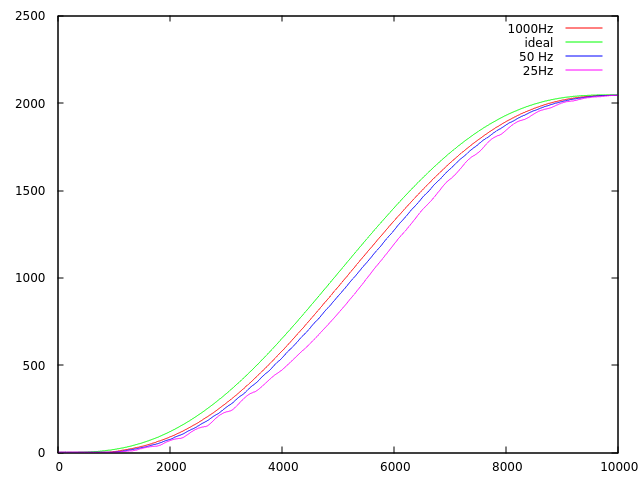

This repository contains an open-source alternative firmware for Dynamixel servos.

**Note 1: A bad firmware can break your servo, we are not responsible for any damage
that could be caused by these manipulations.**

**Note 2: Using an alternative firmware may void the warranty of your servo.**

## Supported servos

The currently supported servos are:

* `mx64`: MX-64 & MX-64A

## Building and programming

You'll have to install the arm cross-compilation tools. On debian-like distributions,
you can get it with:

```
    sudo aptitude install build-essential git-core dfu-util openocd python \
        python-serial binutils-arm-none-eabi gcc-arm-none-eabi
```

Then, go to the `firmware/` directory and edit the `Makefile` to set the appropriate
`BOARD` variable, targetting your servo.

You can then run:

```
make
```

Use an USB2Dynamixel, a USB2AX or any hardware that allows communication with your servo,
and bring an appropriate external power supply. Power it off and type:

```
make install
```

This should run the flash script (see `scripts/` directory), that will wait for the servo
to boot for flashing it. Then, simply power on your servo.

## What's new ?

The hardware detection part of the firmware is complete. We can read the magnetic encoder, control the 2 half-bridges that command the motor,  read/write into the ram and the eeprom (flash actually), read the motor's current, read the temperature and read the input voltage.

The hardware abstraction layers we created (motor.*, magnetic_encoder.*, dxl*) are intended to be safe and easy to use. The control.cpp file implements a PID type of control.

A servo using our firmware will be recognized as a MX-64. You can communicate with it using the same protocol you've always used.

(Updated 30/08/2015)
**The firmware is on a stable and usable version**. 
The fields that are not mapped below are either considered of little use or considered not doable with the hardware capacities. Nevertheless, these functionalities can be implemented if  the need arises.
**New, powerfull functionalities have been implemented. More on it below**

## Basic functionalities

Here is the list of what is and is not currently implemented when you write into the MX's RAM:

     - LED : mapped.
     - D Gain : mapped.
     - I Gain : mapped.
     - P Gain : mapped.
     - Torque enable : mapped. (default value is 0, you'll need to change the value at start up)
     - Goal Position : mapped.
     - Moving Speed : mapped. Currently, setting a speed will put the motor in wheel mode (if the "mode" value is set to 5, more on the "mode" value below).
     - Torque Limit : not mapped.
     - Present Position : mapped.
     - Present Speed : mapped.
     - Present Load : not mapped.
     - Present Voltage : mapped.
     - Present Temperature : mapped.
     - Registered : not mapped.
     - Moving : mapped.
     - Lock : not mapped.
     - Punch : not mapped.
     - Current : mapped but very hard to exploit because it is very noisy and the noise
       is not the same if the motor is going CW or CCW.This is the biggest issue we
       encountered, more on that problem in the notes.
     - Torque Control Mode Enable : mapped.
     - Goal Torque : mapped but does not work that well due to the bad current measurement.
     - Goal Acceleration : NOT mapped.

Here is the list of what is and is not currently implemented when you write into the MX's EEPROM (flash):

    - Model Number : mapped.
    - Version Of Firmware : mapped.
    - ID : mapped.
    - Baud Rate : mapped.
    - Return Delay Time : not mapped.
    - CW and CCW angle limits : mapped. Both at 0 means no limits.
    - Highest Limit Temperature : not mapped Currently hard set to 70 degrees.
    - Lowest and highest Limit Voltage : not mapped.
    - Max Torque : not mapped.
    - Status Return level : not mapped.
    - Alarm led : not mapped.
    - Multi turn offset : not mapped.
    - Resolution Divider : not mapped.

## Advanced functionalities
One of the motivations behind this project was to have full control over our hardware. Once the basic stuff was working, we started playing with more advanced funtionalities.

# Predictive control :
One very big limitation of the default firmware is that the only control loop that is available is a PID (which is already an enhanced compared to the RX family that has only a P...).
A PID is meant to compensate the differences between what is predicted by the model of our system and what actually happens. Those differences come from the model limitations (how is the friction modelized? Is the inertia taken in concideration? Etc.), the loopback imprecisions (accuracy and delay) and the external pertubations. The default firmware has no model, meaning that the PID has a lot of work to do.
Let's say we want to follow a predefined trajectory, like a min-jerk trajectory. With a PID-only approach, we compare the ideal trajectory with 3 actual trajectories the motor realized with orders sent at 25Hz, 50Hz and 1000Hz :



## To do  :

     - Modify how the speed is calculated. The speed ranges from 0 to 1023 (and 1024 to 2047
     for the other direction). 1023 is 117.07rpm, 1 is 0.114rpm which is about 8 steps/s
     (the magnetic encoder has 4096 steps). Therefore, to be able to measure a speed of
     0.114rpm, we need to wait 128ms. That's why, In the current version, the speed is
     updated with a 128ms delay. This is very bad when you think "control loop", since delays
     create instability. The easy solution is to reduce precision (unless you're using your
     MX to build a clock, not sure it's useful to get a precision of  0.114rpm). A better
     solution is to reduce precision (ie reduce delay) as speed goes up.
     - Make it possible to set a speed in joint mode (connect control
     loops to each other)

## License

This is under [CC by-nc-sa](http://creativecommons.org/licenses/by-nc-sa/3.0/) license
