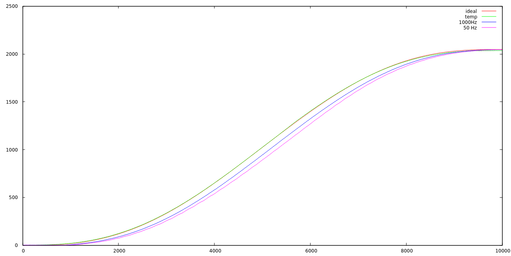
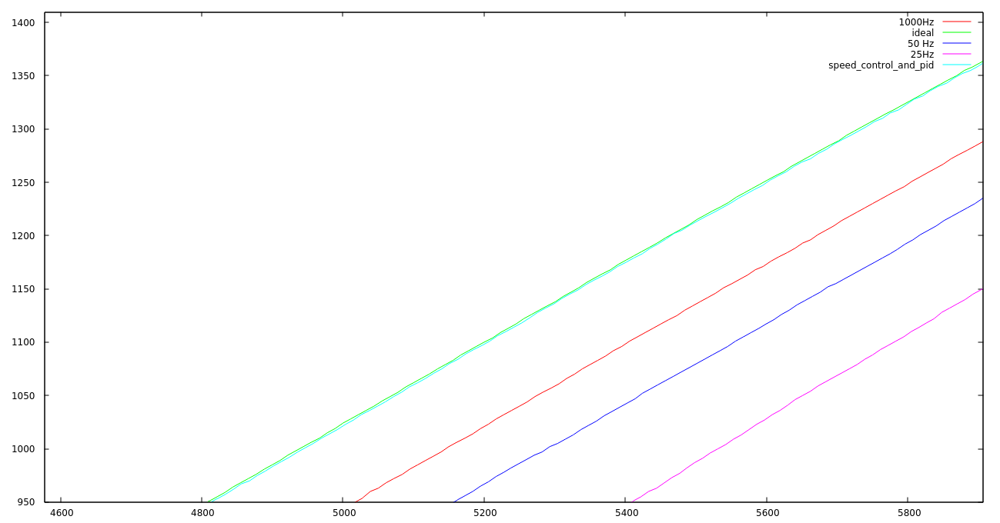
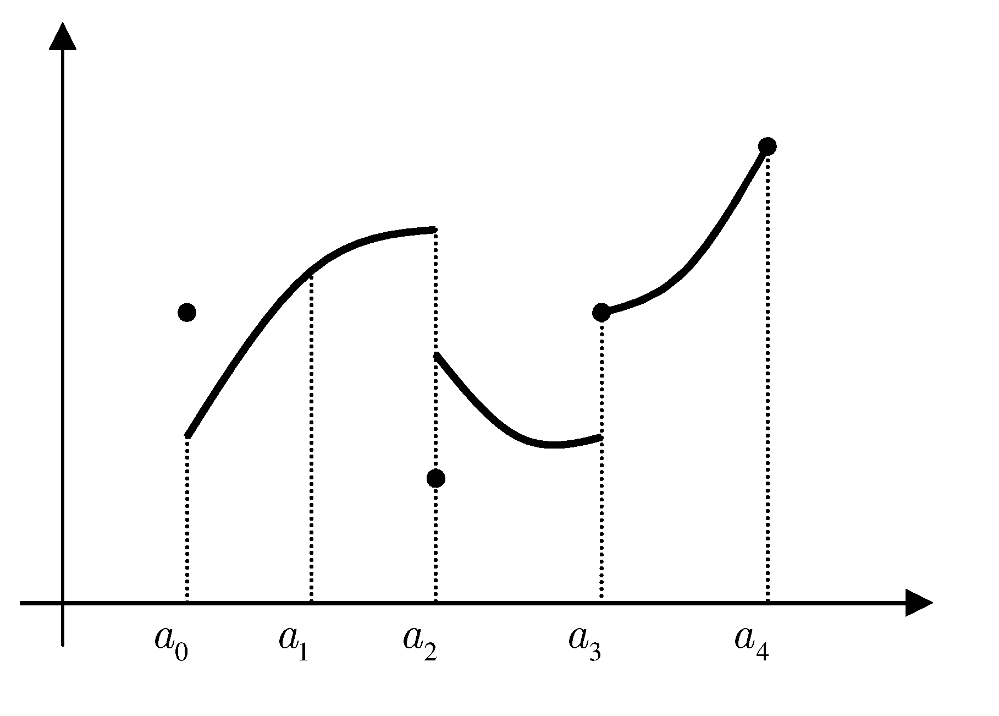

This repository contains an open-source alternative firmware for Dynamixel servos.

**Note 1: A bad firmware can break your servo, we are not responsible for any damage
that could be caused by these manipulations.**

**Note 2: Using an alternative firmware may void the warranty of your servo.**

## Supported servos

The currently supported servos are:

* `mx64`: MX-64 & MX-64A

## Building and programming

You'll have to install the arm cross-compilation tools. On debian-like distributions,
you can get it with:

```
    sudo aptitude install build-essential git-core dfu-util openocd python \
        python-serial binutils-arm-none-eabi gcc-arm-none-eabi
```

Then, go to the `firmware/` directory and edit the `Makefile` to set the appropriate
`BOARD` variable, targetting your servo.

You can then run:

```
make
```

Use an USB2Dynamixel, a USB2AX or any hardware that allows communication with your servo,
and bring an appropriate external power supply. Power it off and type:

```
make install
```

This should run the flash script (see `scripts/` directory), that will wait for the servo
to boot for flashing it. Then, simply power on your servo.

# What's new ?

The hardware detection part of the firmware is complete. We can read the magnetic encoder, control the 2 half-bridges that command the motor,  read/write into the ram and the eeprom (flash actually), read the motor's current, read the temperature and read the input voltage.

The hardware abstraction layers we created (motor.*, magnetic_encoder.*, dxl*) are intended to be safe and easy to use. The control.cpp file implements a PID type of control.

A servo using our firmware will be recognized as a MX-64. You can communicate with it using the same protocol you've always used.

(Updated 30/08/2015)
**The firmware is on a stable and usable version**. 
The fields that are not mapped below are either considered of little use or considered not doable with the hardware capacities. Nevertheless, these functionalities can be implemented if  the need arises.
**New, powerfull functionalities have been implemented. More on it [below](#Advanced functionnalities)**

# Basic functionalities

Here is the list of what is and is not currently implemented when you write into the MX's RAM:

     - LED : mapped.
     - D Gain : mapped.
     - I Gain : mapped.
     - P Gain : mapped.
     - Torque enable : mapped. (default value is 0, you'll need to change the value at start up)
     - Goal Position : mapped.
     - Moving Speed : mapped. Currently, setting a speed will put the motor in wheel mode (if the "mode" value is set to 5, more on the "mode" value below).
     - Torque Limit : not mapped.
     - Present Position : mapped.
     - Present Speed : mapped.
     - Present Load : not mapped.
     - Present Voltage : mapped.
     - Present Temperature : mapped.
     - Registered : not mapped.
     - Moving : mapped.
     - Lock : not mapped.
     - Punch : not mapped.
     - Current : mapped but very hard to exploit because it is very noisy and the noise
       is not the same if the motor is going CW or CCW.This is the biggest issue we
       encountered, more on that problem in the notes.
     - Torque Control Mode Enable : mapped.
     - Goal Torque : mapped but does not work that well due to the bad current measurement.
     - Goal Acceleration : NOT mapped.

Here is the list of what is and is not currently implemented when you write into the MX's EEPROM (flash):

    - Model Number : mapped.
    - Version Of Firmware : mapped.
    - ID : mapped.
    - Baud Rate : mapped.
    - Return Delay Time : not mapped.
    - CW and CCW angle limits : mapped. Both at 0 means no limits.
    - Highest Limit Temperature : not mapped Currently hard set to 70 degrees.
    - Lowest and highest Limit Voltage : not mapped.
    - Max Torque : not mapped.
    - Status Return level : not mapped.
    - Alarm led : not mapped.
    - Multi turn offset : not mapped.
    - Resolution Divider : not mapped.

# <a name="Advanced functionnalities"></a>Advanced functionalities
One of the motivations behind this project was to have full control over our hardware. Once the basic stuff was working, we started playing with more advanced funtionalities.

## <a name="Using the field mode"></a>Using the field 'mode' :
A servo using the Dynaban has diferent mode it can be in. You can set the desired mode by writing a number in the "mode" field (adress 0xA2 in the RAM).
* 0 : Default mode. Uses the PID to follow the goal position. The behaviour should be almost identical to the default firmware
* 1 : Predictive command only. Follows the trajectory set in the traj1 fields but only relying on the model of the motor. This mode can be useful when calibrating the model     
* 2 : PID only. Follows the trajectory set in the traj1 fields but only relying on the PID. 
* 3 : PID and predictive command. Follows the trajectory set in the traj1 fields using both the PID and the predictive command. This should be the default mode when following a trajectory
* 4 : Compliant-kind-of mode. In this mode, the servo will try to act compliant     


## <a name="Predictive control background"></a>Predictive control background :
One very big limitation of the default firmware is that the only control loop that is available is a PID (which is already an enhancement compared to the RX family that has only a P).
A PID is meant to compensate the differences between what is predicted by the model of our system and what actually happens. 
Those differences come from :
- The model limitations (how is the friction modelized? Is the inertia taken in concideration? Etc.)
- The loopback imprecisions (accuracy and delay) 
- The external pertubations. 
**The default firmware has no model**, so the PID has a lot of work to do !
Let's say that we want to follow a predefined trajectory, like a min-jerk trajectory. The servo is attached to a weight of 270g at a distance of 12cm. With a PID-only approach, we compare the ideal trajectory with 3 actual trajectories the motor realized with orders sent at 25Hz, 50Hz and 1000Hz :


Even though the static precision is perfect (the I part of the PID ensures a null static error), the dynamic precision is not and even reaches ~8° when the speed is maximum. In a 6 DOF robotic linear arm, where the errors stack up, the lack of dynamic precision is prohibitive. Increasing the frequency of the orders improves the quality of the result but the enhancement is capped, there would be almost no diference in quality between the 1000Hz curve and a 2000Hz curve. By construction, a PID-only approach will always lag behind a moving command. Again, this is normal, the PID was not made to be used alone.

In order to overcome this problem, the Dynaban firmware implements a model of the motor. More precisely :

- A model of the electric motor (essentialy the relationship between input voltage, rotation speed and output torque)
- A model of the frictions (with an estimation of the static friction and the coulomb friction)
- An inertial model

After tuning the model, we managed to get decent results with a **full open loop approach** : 


And almost perfect results (< 0.4°) when we combine the model and the PID :


## <a name="How to use the predictive control?"></a>How to use the predictive control? :
The idea here is to tell the servo what it will have to do in the near future and let it try to match it. More precisely :
- The servo needs to know the positions it should be at in the near future
- The servo needs to know the torques it should output in the near future

In order to achieve that, you'll have to :
- Choose the duration of the spline (i.e. what we called "near future")
- Send a polynome describing the expected positions for the duration. You can choose the degree of the polynome between 0 and 4. If the polynome looks like a0 + a1*t + a2*t², then you'll have to send the 3 floats a0, a1 and a2 to the servo and set trajPoly1Size to 3.
- Send a polynome describing the expected torque for the duration. The 2 polynomes don't need to be of equal degrees.

Once these informations have been set, the servo will try to follow the trajectory as soon as the field "mode" is set to 1, 2 or 3 (cf [Using the field mode](#Using the field mode)).

When the trajectory ends, the field "mode" will automatically be set to 0 (default, position control mode). Basically, the servo will try to stay where it landed at the end of the trajectory. [Unless you want to continue your trajectory with an other one.](#How do I smoothly continue a trajectory after the first one ended ?)

## <a name="How do I smoothly continue a trajectory after the first one ended ?"></a>How do I smoothly continue a trajectory after the first one ended ?
As you can notice in the [RAM mapping extention](#RAM mapping extention), the fields needed to use the predictive control are present twice. Once under the name of traj1 and once under the name of traj2 (trajPoly2Size, trajPoly2, torquePoly2, etc).
The fields traj2 are a buffer that will be copied into the traj1 fields once the traj1 finishes. 

For this behaviour to happen, you'll have to set copyNextBuffer to 1. copyNextBuffer is automatically set to 0 when the buffer is copied. So, in order to continue a trajectory several times, the procedure would be :
- Update traj2 and set copyNextBuffer to 1
- Once traj1 is finished, update traj2 and set copyNextBuffer to 1
- Once traj1 is finished, update traj2 and set copyNextBuffer to 1
etc.

The transitions between the trajectories should be made in a way that ensures the continuity of both torque and position trajectories and their derivates. Don't do this :>)


## <a name="RAM mapping extention"></a>RAM mapping extention
The RAM chart of the MX-64 ends with the field "goalAcceleration" on the adress 0x49. On the Dynaban firmware, the chart is increased with the following fields :

    unsigned char trajPoly1Size;            // 0x4A
    float         trajPoly1[DXL_POLY_SIZE]; //[0x4B
                                            //[0x4F
                                            //[0x53
                                            //[0x57
                                            //[0x5B
    unsigned char torquePoly1Size;          // 0x5F
    float         torquePoly1[DXL_POLY_SIZE];//[0x60
                                            //[0x64
                                            //[0x68
                                            //[0x6C
                                            //[0x70
    uint16        duration1;                // 0x75

    unsigned char trajPoly2Size;            // 0x76
    float         trajPoly2[DXL_POLY_SIZE]; //[0x77
                                            //[0x7B
                                            //[0x7F
                                            //[0x83
                                            //[0x87
    unsigned char torquePoly2Size;          // 0x8B
    float         torquePoly2[DXL_POLY_SIZE];//[0x8C
                                            //[0x90
                                            //[0x94
                                            //[0x98
                                            //[0x9C
    uint16        duration2;                // 0xA0
    unsigned char mode;                     // 0xA2
    unsigned char copyNextBuffer;           // 0xA3


## To do  :

     - Modify how the speed is calculated. The speed ranges from 0 to 1023 (and 1024 to 2047
     for the other direction). 1023 is 117.07rpm, 1 is 0.114rpm which is about 8 steps/s
     (the magnetic encoder has 4096 steps). Therefore, to be able to measure a speed of
     0.114rpm, we need to wait 128ms. This is very bad when you think "control loop", since delays
     create instability. The easy solution is to reduce precision (unless you're using your
     MX to build a clock, not sure it's useful to get a precision of  0.114rpm). A better
     solution is to reduce precision (ie reduce delay) as speed goes up.
     - Make it possible to set a speed in joint mode (connect control
     loops to each other)

## License

This is under [CC by-nc-sa](http://creativecommons.org/licenses/by-nc-sa/3.0/) license

